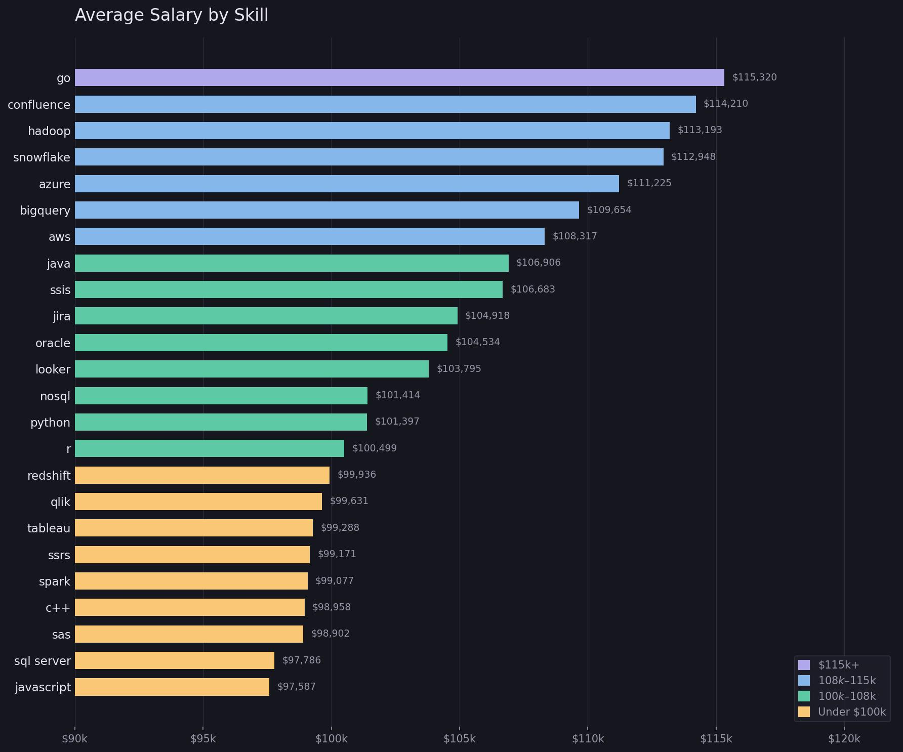

# Introduction
Diving int the job market of 2023, this project explores top-paying jobs, in-demand skills, and where high demand meets high salary in data analytics.

Check out the SQL queries here: [project_sql_folder](/project_sql/)

# Background
1. What are the top-paying data analyst jobs?
2. What skills are required for these top-paying jobs?
3. What skills are most in demand for data analysts?
4. Which skills are associated with higher salaries?
5. What are the most optimal skills to learn?

# Tools I Used
For my deep dive into the data analyst job market, I utilized a few key tools:

- **SQL**: Allows me to query the database and discover critical insights.
- **PostgresSQL**: The Chosen database management system, used for handling the job posting data.
- **Visual Studio Code**: For data management and executing SQL queries.
- **Git & Github**: Essential for version control and sharing my SQL scripts and analysis.

# The Analysis
## 1. Top Paying Data Analyst Jobs
This analysis identifies the highest-paying remote data analyst roles by filtering job postings with listed salaries and ranking them from highest to lowest. It highlights where top compensation exists and which companies are offering the most competitive salaries.
```sql
SELECT
    job_id,
    job_title,
    job_location,
    job_schedule_type,
    salary_year_avg,
    job_posted_date,
    name AS company_name
FROM
    job_postings_fact
LEFT JOIN
    company_dim ON job_postings_fact.company_id = company_dim.company_id
WHERE
    job_title_short = 'Data Analyst' AND
    job_location = 'Anywhere' AND
    salary_year_avg IS NOT NULL
ORDER BY
    salary_year_avg DESC
LIMIT 10;
```

## 2. Top Paying Job Skills
This analysis examines the skills required for the highest-paying data analyst jobs by linking top salary roles with their associated skills. It reveals which technical abilities are most commonly expected in high-paying positions.
```sql
WITH top_paying_jobs AS
(
    SELECT
        job_id,
        job_title,
        job_location,
        job_schedule_type,
        salary_year_avg,
        job_posted_date,
        name AS company_name
    FROM
        job_postings_fact
    LEFT JOIN
        company_dim ON job_postings_fact.company_id = company_dim.company_id
    WHERE
        job_title_short = 'Data Analyst' AND
        job_location = 'Anywhere' AND
        salary_year_avg IS NOT NULL
    ORDER BY
        salary_year_avg DESC
    LIMIT 10
)

SELECT
    top_paying_jobs.*,
    skills
FROM
    top_paying_jobs
INNER JOIN
    skills_job_dim ON top_paying_jobs.job_id = skills_job_dim.job_id
INNER JOIN
    skills_dim ON skills_job_dim.skill_id = skills_dim.skill_id
ORDER BY
    salary_year_avg DESC
```

## 3. Top In Demand Skills
This analysis determines the most frequently requested skills in remote data analyst job postings. By counting how often each skill appears, it shows which skills are currently most sought after in the job market.
```sql
SELECT
    skills,
    COUNT(skills_job_dim.job_id) AS demand_count
FROM
    job_postings_fact
INNER JOIN
    skills_job_dim ON job_postings_fact.job_id = skills_job_dim.job_id
INNER JOIN
    skills_dim ON skills_job_dim.skill_id = skills_dim.skill_id
WHERE
    job_title_short = 'Data Analyst' AND
    job_work_from_home = TRUE
GROUP BY
    skills
ORDER BY
    demand_count DESC
LIMIT 5;
```

## 4. Top Paying Skills
This analysis focuses on which skills are associated with the highest average salaries. By averaging salaries across jobs requiring each skill, it highlights the most financially valuable skills for data analysts.
```sql
SELECT
    skills,
    ROUND(AVG(salary_year_avg), 0) AS avg_salary
FROM
    job_postings_fact
INNER JOIN
    skills_job_dim ON job_postings_fact.job_id = skills_job_dim.job_id
INNER JOIN
    skills_dim ON skills_job_dim.skill_id = skills_dim.skill_id
WHERE
    job_title_short = 'Data Analyst'
    AND salary_year_avg IS NOT NULL
    AND job_work_from_home = TRUE
GROUP BY
    skills
ORDER BY
    avg_salary DESC
LIMIT 25;
```

## 5. Optimal Skills
This analysis combines both demand and salary data to identify the most strategic skills to learn. It highlights skills that are not only high-paying but also frequently requested, making them the best investment for career growth.
```sql
SELECT
    skills_dim.skill_id,
    skills_dim.skills,
    COUNT(skills_job_dim.job_id) AS demand_count,
    ROUND(AVG(job_postings_fact.salary_year_avg), 0) AS avg_salary
FROM
    job_postings_fact
INNER JOIN
    skills_job_dim ON job_postings_fact.job_id = skills_job_dim.job_id
INNER JOIN
    skills_dim ON skills_job_dim.skill_id = skills_dim.skill_id
WHERE
    job_title_short = 'Data Analyst'
    AND salary_year_avg IS NOT NULL
    AND job_work_from_home = TRUE
GROUP BY
    skills_dim.skill_id
HAVING
    COUNT(skills_job_dim.job_id) > 10
ORDER BY
    avg_salary DESC,
    demand_count DESC
LIMIT 25;
```

